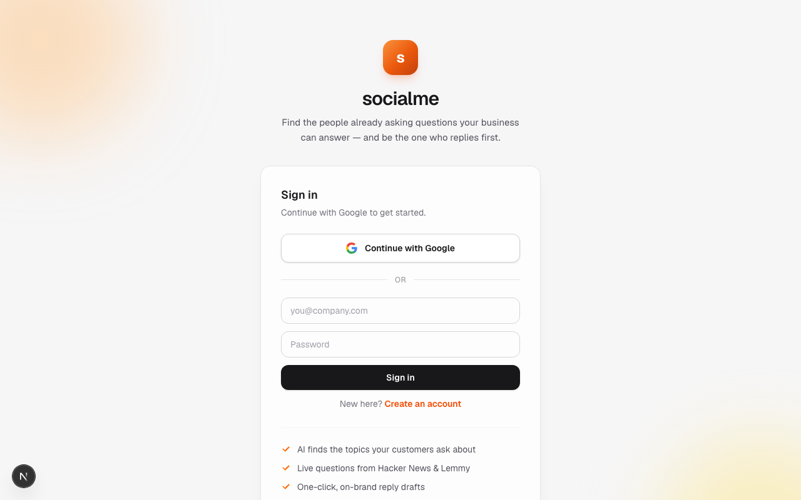

# socialme

Find the people already asking questions your business can answer — and be the one who replies first.

**socialme** is a multi-tenant social-listening tool for businesses. Tell it what you do, and it finds real "voice of the customer" threads across the open web where people are asking for help or recommendations in your niche — then drafts an on-brand reply you can post.

## What it does

- **AI topic discovery** — describe your business; Claude (or GPT) suggests the searchable topics your customers actually ask about, so you don't have to guess.
- **Multi-source scan** — pulls genuine help/recommendation questions from **Hacker News** (Ask HN), **Stack Exchange** (Software Recommendations + Web Apps), and **Lemmy**, filtering out self-promotion and non-questions.
- **Reddit via Claude** — on Anthropic, it uses Claude's `web_search` tool to live-search `reddit.com` for recent question threads, sidestepping the Reddit API entirely.
- **AI reply drafts** — one click generates a genuinely helpful, non-spammy reply in your business's voice, ready to copy and post.
- **Bring-your-own AI key** — each tenant picks Anthropic or OpenAI and their model; the key is stored per-account.
- **Tidy feed** — color-coded sources, mark-answered / hide controls, and a rolling 5-day window so it only ever shows fresh questions.

## Screenshot



## Install

```bash
git clone https://github.com/Still-InFrame/day-15-socialme.git
cd day-15-socialme
npm install
npm run dev
```

Then open http://localhost:3000. You'll need a Supabase project (URL + publishable key in `.env.local`) and — entered in-app — your own Anthropic or OpenAI API key.

## Stack

Next.js (App Router) · TypeScript · Tailwind CSS · Supabase (auth + Postgres with row-level security) · Google + email/password auth · Anthropic / OpenAI APIs.

---

Built as Day 15 of Savion's 100 Day AI Build Challenge → https://www.100dayaichallenge.com/share/savion
